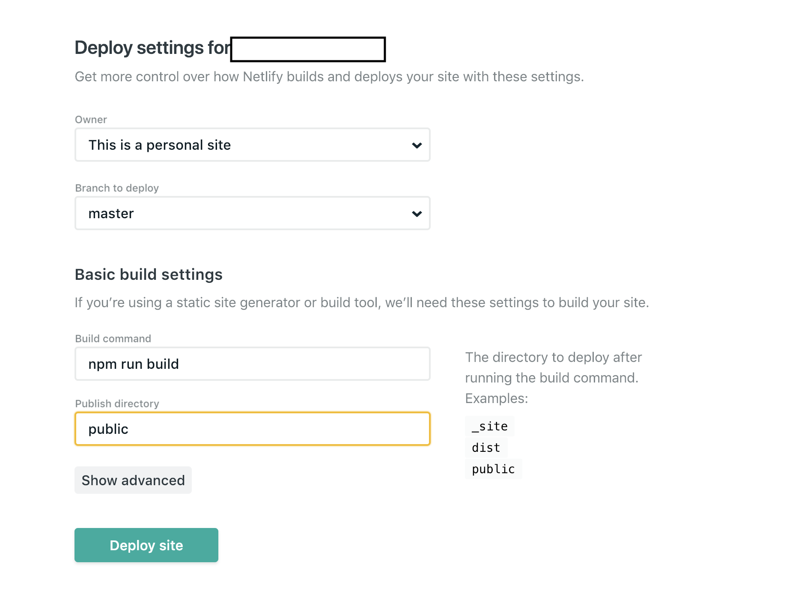

# Deployment

## Netlify

Head over to https://netlify.com and click on new site from git:


It will ask you to choose a provider and choose the one you are using. After that it will ask you for what repo it is and after you selected it just select these options on the next screen:



_The public folder may be a different one depending on the dist folder you selected_

## Now

To use now first create a file called `now.json` and put the follwing options in it:

```json
{
  "version": 2,
  "builds": [
    {
      "src": "package.json",
      "use": "@now/static-build",
      "config": { "distDir": "public" }
    }
  ]
}
```

_The distDir folder may be a different one depending on the dist folder you selected_

After this if you build script is already fiddly you are good to go. If not you should add a `now-build` to let now know it should use that to build your site.

```json
{
  "now-build": "npm run build"
}
```

## Github Pages

// Todo

## Gitlab Pages

// Todo
