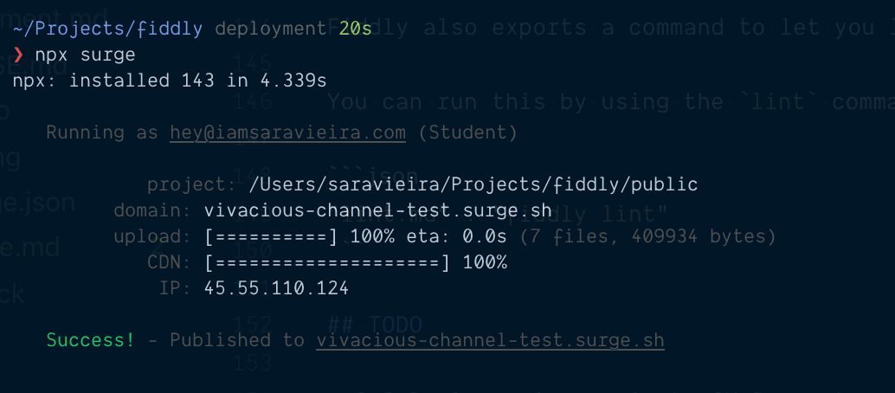

# Deployment

<br/>

- [Netlify](#netlify)
- [Now](#now)
- [Surge](#surge)
- [GitHub Pages](#githubpages)
- [GitLab Pages](#gitlabpages)

## Netlify

Head over to https://netlify.com and click on new site from git:


It will ask you to choose a provider and choose the one you are using. After that it will ask you for what repo it is and after you selected it just select these options on the next screen:


_The public folder may be a different one depending on the dist folder you selected_

## Now

To use Now, first create a file called `now.json` and put the following options in it:

```json
{
  "version": 2,
  "builds": [
    {
      "src": "package.json",
      "use": "@now/static-build",
      "config": { "distDir": "public" }
    }
  ]
}
```

_The distDir folder may be a different one depending on the dist folder you selected_

For Now to build fiddly when deploying, to ensure a fresh build for each deployment, add the following script to your `package.json` scripts list to let Now know to use fiddly to build your readme as the index.

```json
{
  "now-build": "fiddly"
}
```

For more info you can check the [Now docs](https://zeit.co/docs/)

## Surge

To deploy with Surge you need a http://surge.sh account and then to install the surge cli or like me run with npx.
It will ask you to login and after that it wants to know the project path. In here you put the dist folder.
After that pick and domain and done 🎉



## GitHub Pages

For GitHub pages there is a command:

```bash
fiddly deploy
```

This command will build your project if no version exists and deploy it to `gh-pages` branch on github.
It uses [gh-pages](https://github.com/tschaub/gh-pages#options) under the hood so any options you pass there you can also pass in your `deployment` option in `.fiddly.config.json`.
✨

## Gitlab Pages

To deploy to Gitlab Pages add a new job with the title _pages_ in your `.gitlab-ci.yml` configuration file.
Gitlab Pages hosts your static files at `https://<group-or-user-name>.gitlab.io/<project-name>`.
You can use the `PATH_PREFIX` environment variable to configure your fiddly build.
🎉

```yaml
pages:
  image: node
  script:
    - PATH_PREFIX="/$CI_PROJECT_NAME" npx fiddly
  artifacts:
    paths:
      - public
  only:
    - master
```
